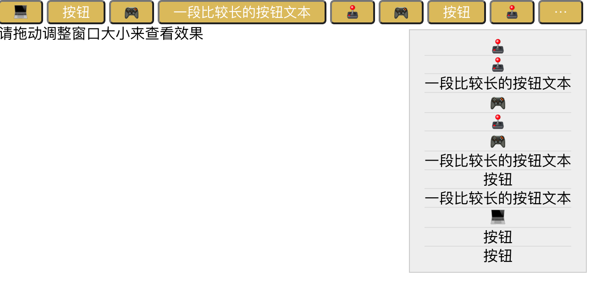
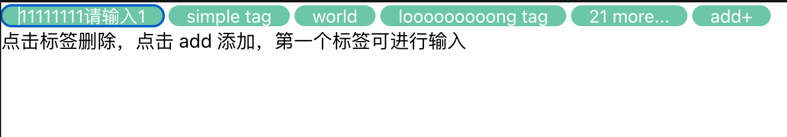

# useOverflow

## 使用场景

当使用横向控件组，容器宽度未知，又不希望控件超出容器范围或换行时，可以使用 `useOverflow` 来让控件自动调整宽度。

常见使用场景如：

-   标签组自动缩略
-   按钮组宽度不够缩略为更多




## 安装

```sh
npm install @zreact/use-overflow
```

## 使用

```jsx
// count 为当前使用的测量数量
// measuredCount 为经过测量后最终得到的合适的数
const [count, measuredCount] = useOverflow({
    containerRef: containerRef, // 外层容器的 ref
    total: tags.length // 项目的总数
});
```

## API

## DEMO

简单场景

<iframe src="https://codesandbox.io/embed/use-overflow-demo-3wf8c4?autoresize=1&fontsize=14&hidenavigation=1&theme=dark"
    style="width:100%; height:500px; border:0; border-radius: 4px; overflow:hidden;"
    title="use-overflow demo"
    allow="accelerometer; ambient-light-sensor; camera; encrypted-media; geolocation; gyroscope; hid; microphone; midi; payment; usb; vr; xr-spatial-tracking"
    sandbox="allow-forms allow-modals allow-popups allow-presentation allow-same-origin allow-scripts"
></iframe>

内容可变场景

<iframe src="https://codesandbox.io/embed/use-overflow-demo-editable-4eb7ky?autoresize=1&fontsize=14&hidenavigation=1&theme=dark"
    style="width:100%; height:500px; border:0; border-radius: 4px; overflow:hidden;"
    title="use-overflow demo editable"
    allow="accelerometer; ambient-light-sensor; camera; encrypted-media; geolocation; gyroscope; hid; microphone; midi; payment; usb; vr; xr-spatial-tracking"
    sandbox="allow-forms allow-modals allow-popups allow-presentation allow-same-origin allow-scripts"
></iframe>

内容可编辑场景

<iframe src="https://codesandbox.io/embed/use-overflow-demo-inputable-pzsde4?autoresize=1&fontsize=14&hidenavigation=1&theme=dark"
    style="width:100%; height:500px; border:0; border-radius: 4px; overflow:hidden;"
    title="use-overflow demo inputable"
    allow="accelerometer; ambient-light-sensor; camera; encrypted-media; geolocation; gyroscope; hid; microphone; midi; payment; usb; vr; xr-spatial-tracking"
    sandbox="allow-forms allow-modals allow-popups allow-presentation allow-same-origin allow-scripts"
></iframe>

按钮组

<iframe src="https://codesandbox.io/embed/use-overflow-button-demo-0eby5y?autoresize=1&fontsize=14&hidenavigation=1&theme=dark"
    style="width:100%; height:500px; border:0; border-radius: 4px; overflow:hidden;"
    title="use-overflow button demo"
    allow="accelerometer; ambient-light-sensor; camera; encrypted-media; geolocation; gyroscope; hid; microphone; midi; payment; usb; vr; xr-spatial-tracking"
    sandbox="allow-forms allow-modals allow-popups allow-presentation allow-same-origin allow-scripts"
></iframe>
